<div dir="rtl">

# WebScripts — یو ځل لار وښایاست، تل به یې پخپله تعقیبوي

په ویب کې خپل کار یو ځل ترسره کړئ — پروګرام ټول کلیکونه، لیکل او تنظیمات **ثبتوي**.
بیا چې کله وغواړئ، په یوه تڼۍ ټوله لار **پخپله** بیا ترسره کوي.

| | |
|---|---|
| پلټفورم | Windows 10/11 |
| بېک اېنډ | Python 3.10+ |
| ظاهري ډیزاین | Flutter 3.27+ (Dart) — د macOS په څېر · **وزیرمتن** فونټ |
| اتومات کول | Selenium + Edge / Chrome / Brave / Vivaldi / Opera |
| اکاونټونه | یو ځل ننوتل — کوکیز خوندي کېږي، بیا پټنوم نه غواړي |
| بسته | یو واحد `WebScripts-Setup.exe` + پورټبل `.7z` (GitHub Actions یې جوړوي) |

## ښکارېدنه

لاندې انځورونه **د چلېدونکي پروګرام حقیقي سکرین شاټونه دي** — د HTML مدل نه.
(`tools/shoot_app.py` اصلي Flutter برنامه پر مجازي ډیسپلې چلوي، په ریښتیني
کلیکونو کې ګرځي او د کړکۍ عکس اخلي.)

| | |
|---|---|
|  |  |
| **داشبورډ** | **سکریپټونه** — ثبت شوي لارښوونې |
| 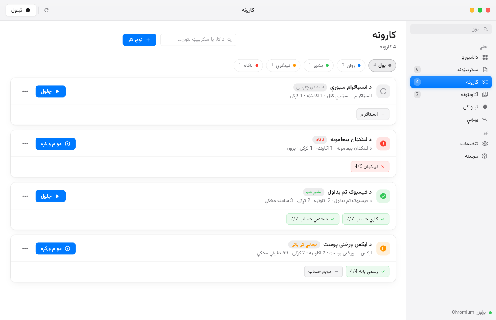 | 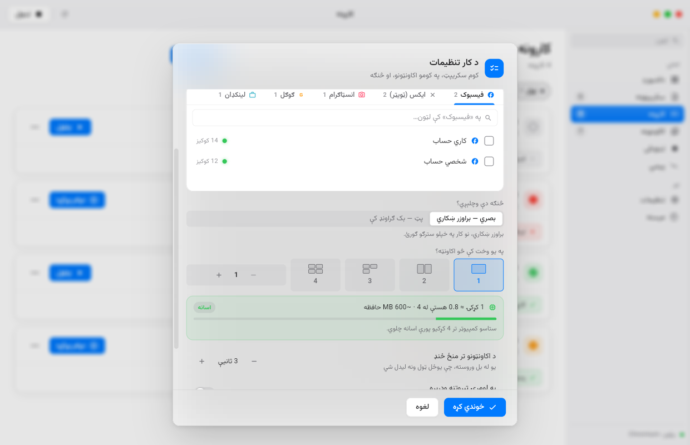 |
| **کارونه** — فلټر، لټون، او هر کار خپل رنګ | **د کار تنظیمات** — اکاونټونه، بصري/پټ، او د کمپیوټر د وس اندازه |
| 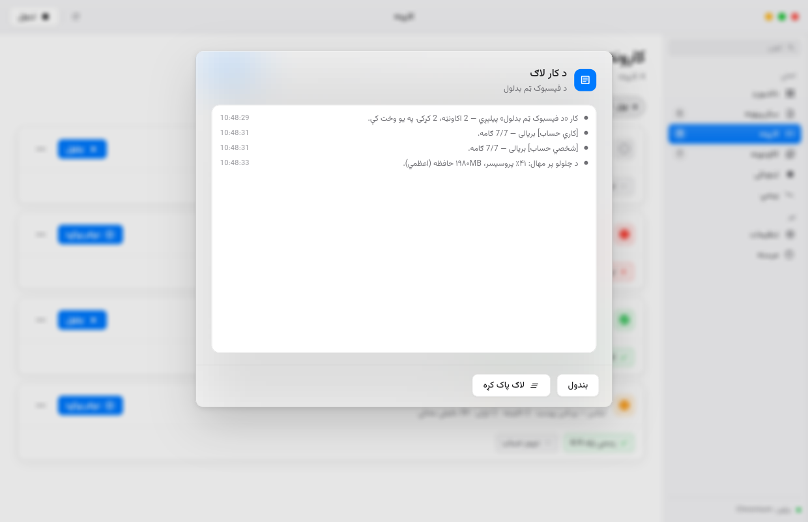 | 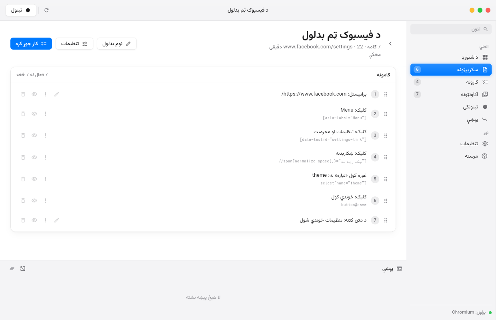 |
| **د هر کار خپل لاګ** | **د سکریپټ ګامونه** |
| 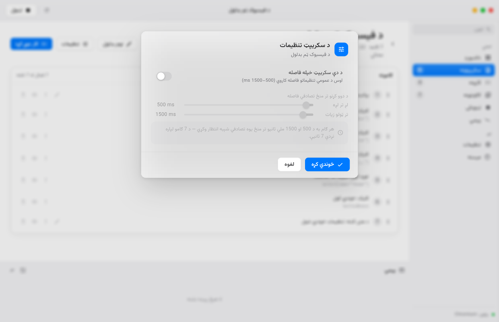 | 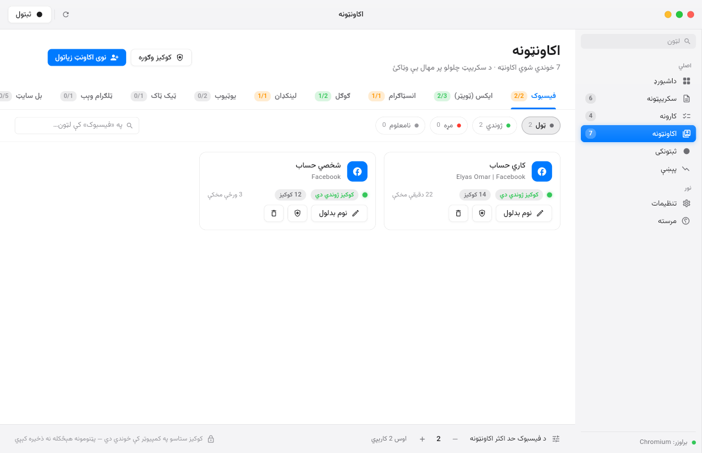 |
| **د سکریپټ خپله فاصله** — د دوو کړنو تر منځ | **اکاونټونه** — د کوکیزو ژوندی/مړ حالت، فلټر او لټون |
| 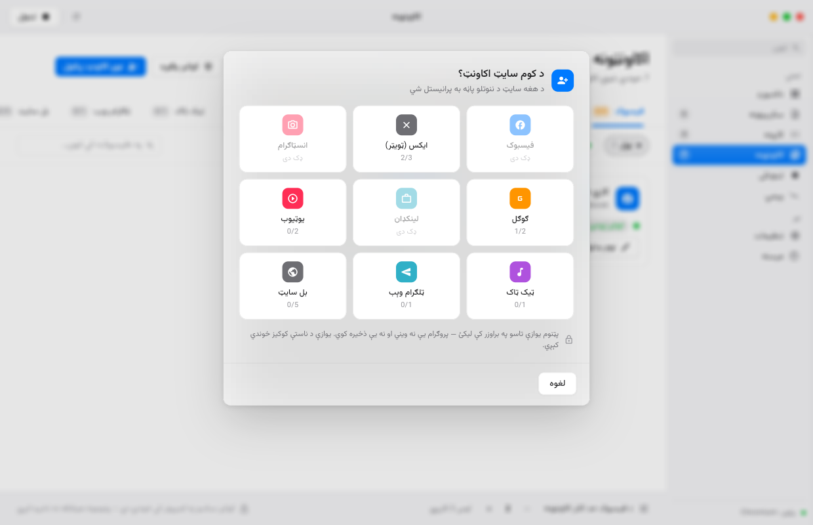 | 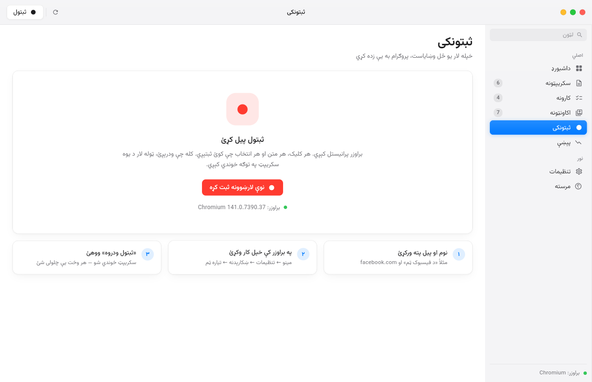 |
| **نوی اکاونټ** | **ثبتونکی** |
| 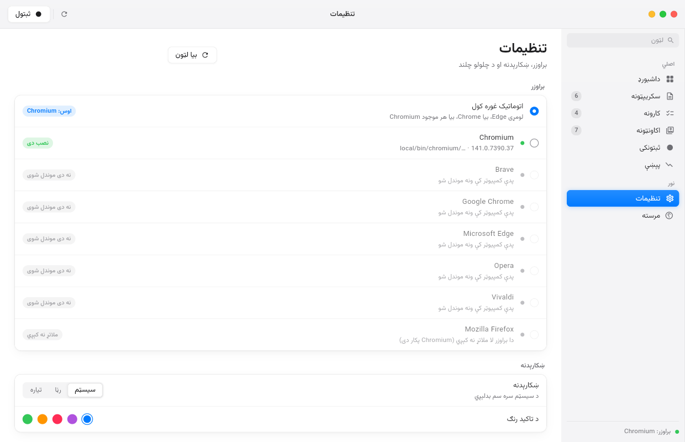 | 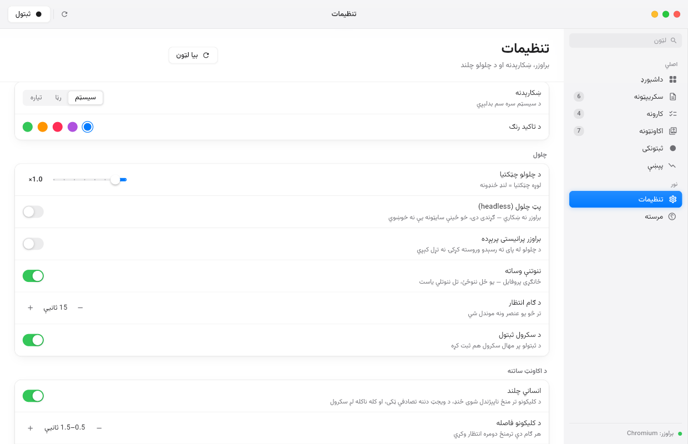 |
| **تنظیمات** | **د اکاونټ ساتنه** |
| 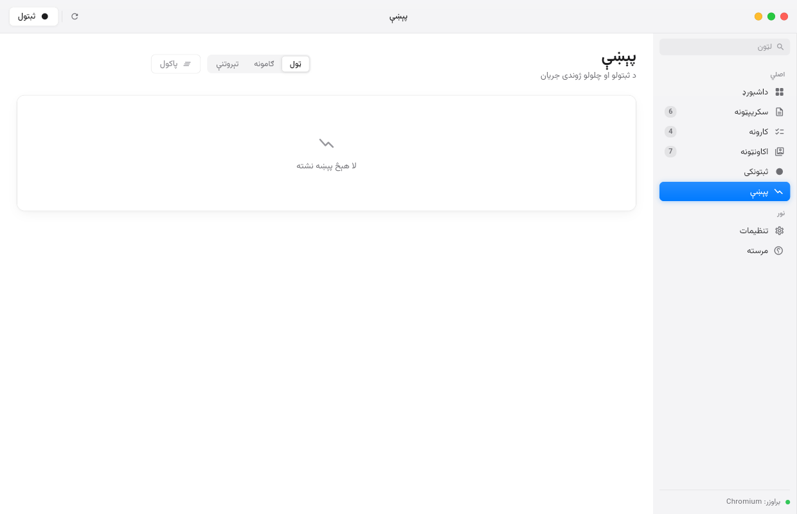 | 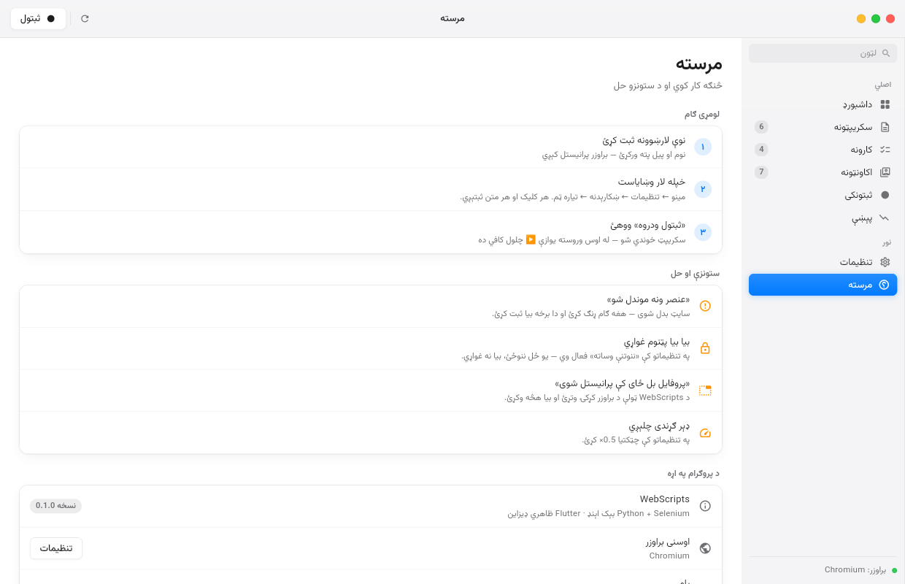 |
| **پېښې** | **مرسته** |
| 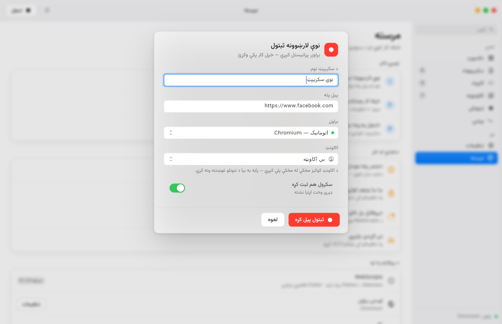 | |
| **نوې لارښوونه** | |

---

## کارونه — سکریپټ + اکاونټونه

سکریپټ وایي **څه وکړه**؛ کار وایي **د چا په نامه یې وکړه**. که د ایکس درې
اکاونټونه لرئ، دا یو کار دی چې درې واړه پکې دي — او پروګرام یادوي چې هر یو یې
څنګه تېر شو.

> سکریپټونه نور په خپله پاڼه کې نه چلېږي. هلته یې یوازې ثبتوئ او سموئ؛ چلول
> د **کارونو** له لارې کېږي.

### د کار تنظیمات

| | |
|---|---|
| **نوم** | چې په لیست کې یې وپېژنئ |
| **سکریپټ** | کوم ثبت شوی سکریپټ دې وچلېږي |
| **اکاونټونه** | د هرې کټګورۍ خپل ټب، او د هغه ټب دننه د لټون کړکۍ |
| **بصري یا پټ** | براوزر ښکاري، یا بک ګراونډ کې چلېږي (لاندې وګورئ) |
| **همزمانه کړکۍ** | څومره چې وغواړئ — پروګرام درته وایي چې دا شمېر ستاسو پر کمپیوټر څومره فشار دی |
| **د اکاونټونو ترمنځ ځنډ** | چې ټول یو ځل ونه لیدل شي |
| **په لومړۍ تېروتنه ودرېږه** | یا پاتې اکاونټونه هم وچلوه |
| **براوزر پرانیستی پرېږده** | د کار له پای ته رسېدو وروسته |

### د کارونو لیست

هر کار خپل رنګ لري:

| رنګ | معنا |
|---|---|
| 🟢 شین | ټول اکاونټونه بشپړ شول |
| 🔴 سور | ټول ناکام شول |
| 🟡 ژیړ | نیمایي کې پاتې — ځینې بشپړ، ځینې لا نه دي چلېدلي |
| ⚪ سپین | لا یو ځل هم نه دی چلېدلی |

د پاڼې پورته برخه کې د **فلټر** ټکي (ټول · روان · بشپړ · نیمګړي · ناکام، هر یو
خپل شمېر سره) او د **لټون** کړکۍ ده.

هر کار یوه اصلي تڼۍ لري (**چلول** یا **دوام ورکړه**) او یو **⋯ منو** چې دا
پکې دي: **لاګ وګوره** · **له سره وچلوه** · **تنظیمات** · **ړنګول**.

### د هر کار خپل لاګ

هر کار خپل لاګ فایل لري (`task-logs/<id>.jsonl`) — نو هغه کار چې تېره اونۍ
چلېدلی و، لا هم لوستلی شئ: کوم اکاونټ بریالی شو، کوم ناکام او ولې، او د
چلولو پر مهال یې څومره پروسیسر او حافظه ونیوله.

### څو کړکۍ زما کمپیوټر زغمي؟

کله چې شمېره بدلوئ، پروګرام سمدلاسه حساب کوي:

```
۴ کړکۍ ≈ ۲٫۵ هستې له ۸ · ~۱٫۷GB حافظه   [اسانه]
ستاسو کمپیوټر تر ۹ کړکیو پورې اسانه چلوي.
```

دا اټکل د کمپیوټر له ریښتینو هستو او ازادې حافظې څخه جوړېږي (`psutil`)، او د
یوې کروم کړکۍ اوسط لګښت پرې ضرب کېږي. **پټ (headless)** حالت کې پروسیسر نږدې
**۳۵٪** او حافظه نږدې **۲۰٪** کمه کارېږي — ځکه چې پاڼه نه انځورېږي او کړکۍ نه
جوړېږي. خو یاد ولرئ: ځینې سایټونه پټ براوزر اسانه پېژني، نو د قیمتي اکاونټ
لپاره بصري حالت خوندي دی.

د چلولو له پای ته رسېدو وروسته، ریښتینې اندازه هم په لاګ کې لیکل کېږي، نو
اټکل او واقعیت پرتله کولی شئ.

**دوام ورکړه** هغه ستونزه حل کوي چې تاسو یې یادونه وکړه: که مو درې ایکس
اکاونټونه وو او په دویم کې ودرېد (قصداً یا په تېروتنه)، «دوام ورکړه» یوازې
هغه اکاونټونه چلوي چې پاتې دي — لومړی له سره نه پیلېږي. د هر اکاونټ حالت د
کار د کارټ لاندې د یوې کوچنۍ نښې په بڼه ښکاري (`4/6` یعنې څلور ګامه له شپږو).

---

## ستاسو مثال: د فیسبوک ټم بدلول

1. برنامه پرانیزئ او **«نوې لارښوونه»** ووهئ
   نوم: `د فیسبوک ټم` — پته: `https://www.facebook.com`
2. Edge پرانیستل کېږي، پورته ښي خوا کې سور نښان ښیي چې **ثبتول روان دي**
3. په براوزر کې خپله لار تعقیب کړئ:
   مینو ← تنظیمات ← ښکارېدنه ← تیاره ټم
4. بېرته برنامې ته راشئ او **«ثبتول ودروه»** ووهئ
5. سکریپټ خوندي شو ✔

له دې وروسته یوازې د **▶ چلول** تڼۍ کافي ده — پروګرام به پخپله همغه لار ووهي.

> **مهمه:** برنامه د Edge لپاره یو ځانګړی پروفایل کاروي، نو یو ځل چې فیسبوک ته
> ننوځئ، هره بله ګرځېدنه کې هم ننوتلی یاست — د بیا بیا پټنوم لیکلو اړتیا نشته.

---

## اکاونټونه — یو ځل ننوځئ، بس

ستاسو ستونزه دا وه: هر ځل چې د فیسبوک ټم بدلولو سکریپټ چلېږي، بیا ننوتل پکار
وي. د **اکاونټونو** پاڼه دا حل کوي.

1. **«نوی اکاونټ زیاتول»** ووهئ → د سایټ لیست ښکاري (فیسبوک، ایکس، انسټاګرام،
   ګوګل، لینکډان، یوټیوب، ټیک ټاک، ټلګرام، بل سایټ)
2. یو یې وټاکئ → د هغه د **ننوتلو پاڼه په یوه کوچنۍ کړکۍ کې** پرانیستل کېږي
3. تاسو هلته په عادي ډول ننوځئ. پروګرام پخپله پېژني چې ننوتل بشپړ شول (د سایټ
   د ناستې کوکي په لیدو) او **کوکیز خوندي کوي** — یا په لاسي ډول «ننوتم» ووهئ
4. اکاونټ خپلې کټګورۍ ته اضافه کېږي

له دې وروسته چې کله یو سکریپټ وچلوئ، پروګرام پوښتي **«د کوم اکاونټ په نامه
یې وچلوم؟»** — هغه اکاونټ چې وټاکئ، د هغه کوکیز او پروفایل کارېږي.

**د ثبتولو پر مهال هم همداسې:** د «نوې لارښوونه» په کړکۍ کې د **اکاونټ** کرښه
ده. که هلته یو اکاونټ وټاکئ، براوزر له همغه اکاونټ سره پرانیستل کېږي او سایټ
به بیا د ننوتلو پاڼه ونه ښیي.

### حد اکثر اکاونټونه

هره کټګوري خپل حد لري او د پاڼې په پای کې یې بدلولی شئ:

| سایټ | لومړنی حد |
|---|---|
| فیسبوک | ۲ |
| ایکس (ټویټر) | ۳ |
| انسټاګرام | ۱ |
| ګوګل / یوټیوب | ۲ |
| لینکډان / ټیک ټاک / ټلګرام | ۱ |

### د کوکیزو ژوندی/مړ حالت

د اکاونټونو پاڼه کې هر اکاونټ یوه کوچنۍ رڼا لري:

| رنګ | معنا |
|---|---|
| 🟢 شین | کوکیز ژوندي دي — سایټ ناسته وپېژندله |
| 🔴 سور | مړه دي — بیا ننوتل پکار دي |
| 🟡 ژیړ | همدا اوس کتل کېږي |
| ⚪ خړ | لا نه دي کتل شوي (یا انټرنیټ نه و) |

**«کوکیز وګوره»** تڼۍ هر اکاونټ ته د هغه خپل سایټ پوښتي: کوکیز په یوه پټه
کړکۍ کې پلي کېږي او لیدل کېږي چې سایټ لا هم ناسته پېژني که نه. که کتنه ونه
شي (انټرنیټ نشته، براوزر نه پرانیستل کېږي) حالت **خړ** پاتې کېږي — هېڅکله
سور نه شي، ځکه غلط سور به مو بې ځایه بیا ننوتلو ته اړ کړي.

همدا رڼا د **کار د تنظیماتو** په اکاونټ لیست کې هم ښکاري، نو مړ اکاونټ به مو
په کار کې ونه غورځول شي. د پاڼې پورته برخه کې د **فلټر** (ټول · ژوندي · مړه ·
نامعلوم) او **لټون** افشنونه دي.

### څنګه خوندي دي؟

- **پټنوم هېڅکله نه ذخیره کېږي** — تاسو یې یوازې په براوزر کې لیکئ
- هر اکاونټ خپل **جلا د براوزر پروفایل** لري، نو ناستې سره نه ګډېږي
- کوکیز په `%LOCALAPPDATA%\WebScripts\accounts\cookies\` کې دي، یوازې د
  مالک د لوستلو اجازې سره (`0600`) — او هېڅکله له کمپیوټره نه وځي

> د ناستې کوکیز د پټنوم هومره حساس دي: څوک چې یې ولري، ننوتلی دی. که کمپیوټر
> بل چا سره شریکوئ، اکاونټونه له همدې پاڼې ړنګ کړئ.

## براوزر

پروګرام پخپله ګوري چې ستاسو کمپیوټر کې کوم براوزر **په ریښتیا نصب دی** —
Edge، Chrome، Brave، Chromium، Vivaldi، Opera. په تنظیماتو کې یې لیست ګورئ
(نسخه + لاره) او هر یو ټاکلی شئ. «اتوماتیک» لومړی Edge غوره کوي.

Firefox پېژندل کېږي خو لا ملاتړ نه کېږي (Chromium پکار دی).

## نصبول

```powershell
git clone <repo-url>
cd web-scripts-app
powershell -ExecutionPolicy Bypass -File scripts\setup.ps1
```

setup سکریپټ دا کارونه کوي:

- د Python مجازي چاپېریال (`backend\.venv`) جوړوي او کڅوړې نصبوي
- د Flutter وینډوز برخه جوړوي (`flutter create --platforms=windows`)
- ګوري چې Edge نصب دی که نه

**د Edge ډرایور نصبولو ته اړتیا نشته** — Selenium یې پخپله راکوزوي.

## چلول

```powershell
powershell -ExecutionPolicy Bypass -File scripts\run.ps1
```

که Flutter نه لرئ، یوازې بېک اېنډ هم بشپړ کار کوي:

```powershell
powershell -ExecutionPolicy Bypass -File scripts\run.ps1 -BackendOnly
```

---

## یو واحد exe جوړول

هر ځل چې کوډ پورته شي، GitHub Actions پخپله وینډوز نسخه جوړوي:
`.github/workflows/build-windows.yml`

- backend د **PyInstaller** په مرسته یو `webscripts-backend.exe` ته بدلېږي (Python ته اړتیا نشته)
- Flutter وینډوز نسخه جوړېږي
- دواړه د **Inno Setup** په مرسته یو واحد **`WebScripts-Setup-0.1.0-x64.exe`** ته بدلېږي
- پورټبل نسخه د **LZMA2** (همغه د xz کمپرسر) په مرسته فشرده کېږي:
  `WebScripts-Portable-0.1.0-x64.7z`

> xz پخپله یوازې **یو فایل** فشرده کولی شي — له همدې امله `tar.xz` شته: لومړی
> tar ټول فایلونه یو کوي، بیا یې xz فشرده کوي. `.7z` همغه LZMA2 کاروي خو پخپله
> ټوله پوښه اداره کوي، نو نه tar پکې شته او (solid) حجم یې لا کم دی — په دې
> پروژه کې د tar.xz په پرتله ۷٪ کوچنی.

هر ورک فلو **یو ریلیز** جوړوي (`build-<شمېره>`) چې دواړه فایلونه پکې دي، او
مخکینی ریلیز پخپله ړنګېږي — نو تل یوازې وروستۍ نسخه پاتې کېږي.
د Actions **Artifact** کې یوازې پورټبل `.tar.xz` اچول کېږي، ترڅو حجم یې لوړ نشي.

پورټبل نسخه د **7-Zip** یا **WinRAR** په ښي کلیک سره پرانیستل کېږي.

په خپل کمپیوټر کې همدا کار:

```powershell
powershell -ExecutionPolicy Bypass -File packaging\build_windows.ps1
```

## بې ظاهري برنامې (کمانډ لاین)

```powershell
cd backend
.venv\Scripts\python.exe -m webscripts.cli record --name "د فیسبوک ټم" --url https://www.facebook.com
.venv\Scripts\python.exe -m webscripts.cli list
.venv\Scripts\python.exe -m webscripts.cli play scr_ab12cd34ef56
.venv\Scripts\python.exe -m webscripts.cli play scr_ab12cd34ef56 --headless --speed 2
```

| کمانډ | کار |
|---|---|
| `record` | نوې لارښوونه ثبتوي (د پای لپاره Enter ووهئ) |
| `list` | د ټولو سکریپټونو لیست |
| `show <id>` | د یوه سکریپټ ګامونه |
| `play <id>` | چلول |
| `delete <id>` | ړنګول |
| `serve` | یوازې د API سرور |

---

## څه ثبتېږي؟

| کړنه | تشریح |
|---|---|
| کلیک | تڼۍ، لینکونه، مینو، چېک باکسونه |
| لیکل | د متن ډکول (پټنومونه **نه** خوندي کېږي) |
| لیست | د `<select>` انتخاب |
| تڼۍ | Enter او Escape |
| پرانیستل | نوې پته چې پخپله یې ولیکئ |
| کړکۍ | نوی ټب/کړکۍ چې پرانیستل شي |
| iframe | د دننه چوکاټونو کلیکونه هم |

### پټنومونه

که د ثبتولو پرمهال پټنوم ولیکئ، **متن یې نه خوندي کېږي**. پرځای یې یو
متغیر (`{{password}}`) جوړېږي، او د چلولو پرمهال یې برنامه له تاسو غواړي.
دا ارزښتونه هېڅکله فایل ته نه لیکل کېږي.

---

## څه ثبتېږي او چلول یې څومره ژر دي؟

> **د هر سکریپټ خپله فاصله:** د سکریپټ پاڼې کې د **تنظیماتو** تڼۍ ده — هلته
> ټاکلی شئ چې د دې سکریپټ د دوو کړنو تر منځ فاصله له څو تر څو **ملي ثانیو**
> تصادفي وي. که ونه ټاکئ، عمومي تنظیمات کارېږي.


سکریپټ **یوازې ستاسو تعاملات** ساتي — کلیک، دوه ځله کلیک، ښي کلیک، لیکل،
لیست ټاکل، تڼۍ (Enter، Esc، غشي، Ctrl+A …)، سکرول، نوې کړکۍ، پاڼې.

هغه څه چې **نه** ثبتېږي: هغه دمه چې تاسو یې د دوو کارونو ترمنځ فکر کولو ته
کاروئ. پخوا به دا هم ثبتېده، نو هر ځل چلول به د ثبتولو د ورځې تر ټولو ورو
شېبې هومره ورو و. اوس چلول خپل تال لري:

- د ګامونو تر منځ **تصادفي ۰٫۵–۱٫۵ ثانیې** (د اکاونټ ساتنې لپاره، لاندې وګورئ)
- عنصر ته انتظار یوازې تر هغې چې پیدا شي
- هغه ګام چې کېدای شي بیا رانغلی وي (لکه د کوکیزو پیغام) یوازې **۲٫۵ ثانیې**
  انتظار کوي، بیا پرېښودل کېږي — نه ټول ۱۵ ثانیې

## د اکاونټ ساتنه (بلاک کېدو مخنیوی)

دا برنامه ستاسو د خپلو اکاونټونو مرستیاله ده، نو د چلولو چلند یې قصداً د
ماشین په څېر **نه** دی. په تنظیماتو کې د «د اکاونټ ساتنه» برخه دا کنټرولوي:

- **د کلیکونو تر منځ ۰٫۵–۱٫۵ ثانیې تصادفي فاصله** (که ثبتولو کې مو ډېر ځنډ
  کړی وي، هغه ساتل کېږي — تل د دواړو لویه)
- **د ویجټ دننه تصادفي ټکی کلیک کېږي**، نه یې دقیق مرکز
- **کله ناکله لږ سکرول** — لکه یو کس چې پاڼه لولي
- **حرف په حرف لیکل** د تصادفي وقفو سره، نه یو ځل ټول متن
- براوزر ته ویل کېږي چې **ځان د اتومات وسیلې په توګه ونه پېژني**
  (`navigator.webdriver` او نور نښې پاکېږي)
- هر اکاونټ **خپل پروفایل** لري، نو ناستې سره نه ګډېږي

## هوښیار ګامونه — که یو عنصر بیا رانغی

لومړی ځل چې ګوګل ته ورشئ، د کوکیزو پیغام ښکاري او تاسو یې تایید کوئ. دوهم
ځل هغه پیغام نه راځي — پخوا به سکریپټ همدلته ناکام شو.

اوس پروګرام یو ورک عنصر داسې څېړي:

1. که تاسو پخپله ګام **«اختیاري»** په نښه کړی وي → پرېښودل کېږي
2. که د ګام تڼۍ د **منلو/بندولو** په څېر ښکاري (`Accept`, `قبول`, `منل`, …)
   → پرېښودل کېږي
3. که **راتلونکی ګام** لا اوس په پاڼه کې موجود وي (یعنې پاڼه مخکې تللې ده)
   → پرېښودل کېږي
4. که هېڅ یو هم نه وي → دا یوه ریښتینې ستونزه ده، سکریپټ درېږي او انځور اخلي

د هر ګام په څنګ کې د **!** / **؟** تڼۍ ده چې «اړین» او «اختیاري» بدلوي.

## براوزر او پروسې — څه وخت تړل کېږي؟

| څه کېږي | براوزر | د Python سرور |
|---|---|---|
| چلول بریالی شي | تړل کېږي (که «پرانیستی پرېږده» بند وي) | روان پاتې |
| چلول ناکام شي یا ودرول شي | **پرانیستی پاتې کېږي** — چې کار مو نیمګړی پاتې نشي | روان پاتې |
| ثبتولو کې تېروتنه وشي | **پرانیستی پاتې کېږي** | روان پاتې |
| یو ټب وتړل شي | ثبتول روان وي، بل ټب ته ځي | روان پاتې |
| د پروګرام کړکۍ وتړل شي | تړل کېږي | **تړل کېږي** |
| پروګرام کریش شي یا په زوره وتړل شي | تړل کېږي | **تړل کېږي** (تر ۲ ثانیو کې) |

سرور د پروګرام د پروسې شمېره (`--parent-pid`) ساتي او هرې دوې ثانیې یې ګوري.
که پروګرام نه وي، سرور پخپله وځي — نو هېڅکله به داسې پروسه پاتې نشي چې نه
کړکۍ ولري، نه یې په Task Manager کې ومومئ، او د پروګرام فولډر یې بند وساتي.

## ولې بیا چلول کار کوي که سایټ بدل شي؟

هر ګام لپاره یوازې یو پته نه، بلکې **څو لارې** ثبتېږي — له تر ټولو ټینګې تر
تر ټولو کمزورې:

```
1. data-testid=…      ← تر ټولو ښه
2. #id (که ثابت وي)
3. name=…
4. aria-label=…
5. placeholder / title
6. د متن له مخې (//button[text()="خوندي کول"])
7. د CSS لار (div > button:nth-of-type(2))
8. بشپړ XPath              ← وروستۍ هڅه
```

د چلولو پرمهال یوه یوه ازمویل کېږي، تر څو یوه ورکار شي. که یوه لار مات شي،
بله یې ځای نیسي.

---

## د سکریپټونو ځای

```
%LOCALAPPDATA%\WebScripts\
├─ scripts\            ← ستاسو سکریپټونه (JSON)
├─ accounts\
│  ├─ accounts.json    ← اکاونټونه او حدونه
│  ├─ cookies\         ← د هر اکاونټ کوکیز (0600)
│  └─ profiles\        ← د هر اکاونټ جلا د براوزر پروفایل
├─ edge-profile\       ← عادي پروفایل (بې اکاونټه چلول)
├─ settings.json       ← تنظیمات
├─ screenshots\        ← د ناکامۍ عکسونه
└─ logs\
```

---

## د پروژې جوړښت

```
backend/
├─ webscripts/
│  ├─ models.py      د معلوماتو جوړښت (Script / Step / Target)
│  ├─ storage.py     JSON ذخیره
│  ├─ accounts.py    د اکاونټونو ذخیره، کټګورۍ او حدونه
│  ├─ login.py      ننوتل پېژندل او د کوکیزو نیول/پلي کول
│  ├─ browsers.py    د نصب شویو براوزرونو پېژندنه
│  ├─ settings.py    د کارونکي تنظیمات (settings.json)
│  ├─ driver.py      د Chromium-کورنۍ ډرایور
│  ├─ js/recorder.js په پاڼه کې ثبتوونکی (JavaScript)
│  ├─ recorder.py    د ثبتولو کړۍ
│  ├─ player.py      بیا چلوونکی
│  ├─ session.py     د براوزر ژوند دوره
│  ├─ server.py      FastAPI + WebSocket
│  └─ cli.py         کمانډ لاین
└─ tests/            pytest (۵۵ ازموینې) + manual_e2e.py

frontend/            Flutter (Dart) — د macOS په څېر ډیسکټاپ برنامه
├─ lib/theme/        د مک ډیزاین ټوکنونه (رنګونه، وړیا فاصلې)
├─ lib/api/          د سرور سره اړیکه + د backend پیلوونکی
├─ lib/models/       ډاټا موډل (سکریپټ، تنظیمات، براوزر)
├─ lib/state/        AppState (provider)
├─ assets/fonts/     وزیرمتن (Regular/Medium/SemiBold/Bold)
├─ lib/screens/      shell · داشبورډ · سکریپټونه · ګامونه · اکاونټونه · ثبتونکی · پېښې · تنظیمات · مرسته
└─ lib/widgets/      ټایټل‌بار · سایډبار · د مک کنټرولونه · شیټونه · لاګ

packaging/           PyInstaller spec · Inno Setup · build_windows.ps1
docs/screenshots/    د چلېدونکي پروګرام حقیقي انځورونه
tools/               seed_demo.py (ډیمو ډاټا) · shoot_app.py (رن + سکرین شاټ)
scripts/             setup.ps1 / run.ps1
.github/workflows/   د وینډوز د exe جوړولو CI
```

## ازموینې

```powershell
cd backend
.venv\Scripts\python.exe -m pytest tests -q

cd ..\frontend
flutter test
```

د بشپړې لړۍ ازموینه (اصلي براوزر پرانیزي: یوه پاڼه ثبتوي، بیا یې چلوي او
پایله ګوري) — د نصبولو وروسته یې یو ځل وچلوئ:

```powershell
cd backend
.venv\Scripts\python.exe tests\manual_e2e.py
```

### سکرین شاټونه بیا جوړول

انځورونه له اصلي چلېدونکي پروګرام څخه اخیستل کېږي (لینکس، مجازي ډیسپلې):

```bash
cd frontend && flutter build linux --debug && cd ..
WEBSCRIPTS_HOME=/tmp/wsdemo python3 tools/seed_demo.py
python3 tools/shoot_app.py --out docs/screenshots
```

---

## ستونزې او حل

| ستونزه | حل |
|---|---|
| «د Edge پروفایل بل ځای کې پرانیستل شوی» | د WebScripts ټول Edge کړکۍ وتړئ |
| «عنصر ونه موندل شو» | سایټ بدل شوی — هغه ګام ړنګ کړئ او بیا یې ثبت کړئ |
| سرور نه نښلي | `scripts\setup.ps1` بیا وچلوئ |
| ډېر ګړندی چلېږي | د سکریپټ پاڼه کې چټکتیا `0.5×` کړئ |

---

## پام

دا وسیله ستاسو د خپلو حسابونو لپاره ده. د هر سایټ د کارونې شرایط (Terms of
Service) په پام کې ونیسئ — ځینې سایټونه اتومات ګرځېدنه نه مني.

</div>
