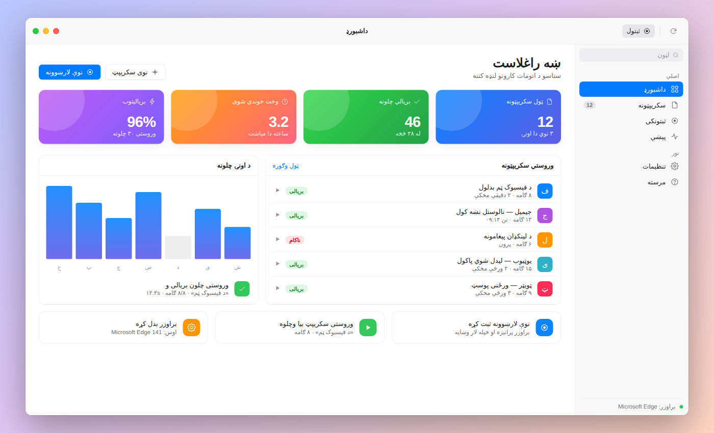
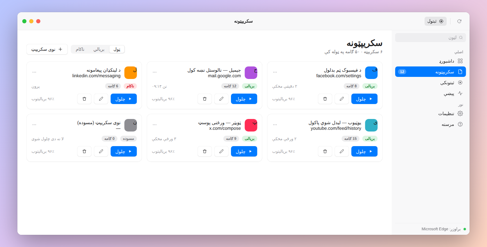
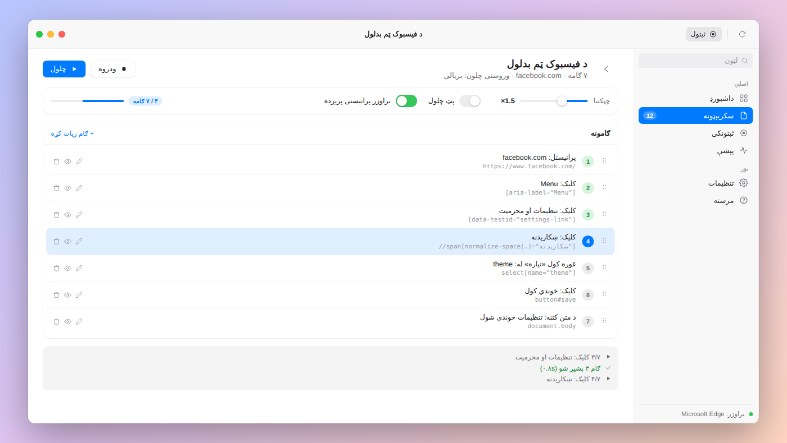
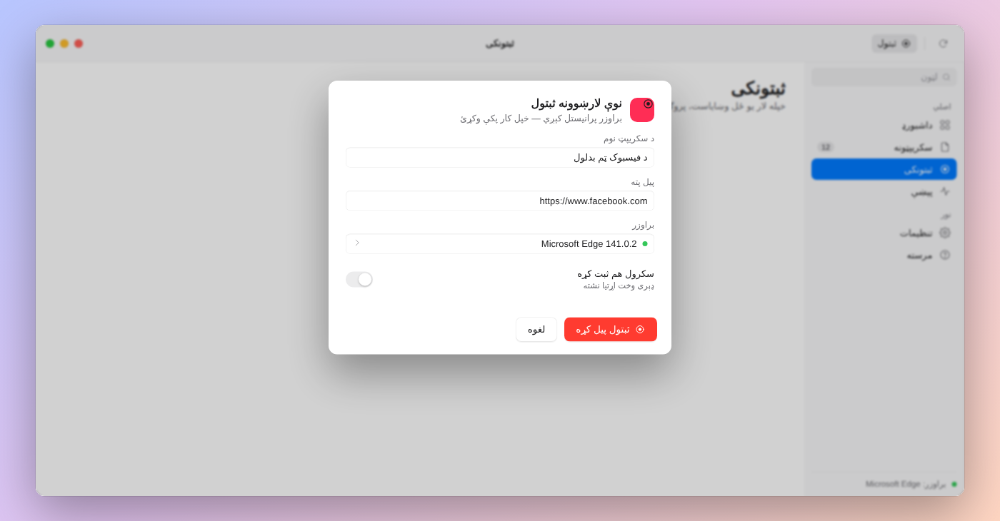
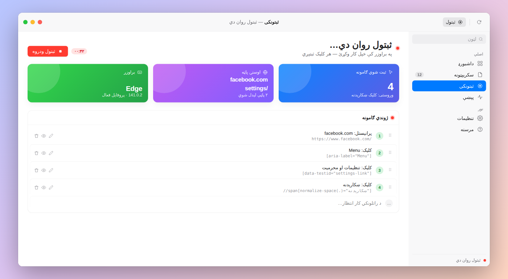
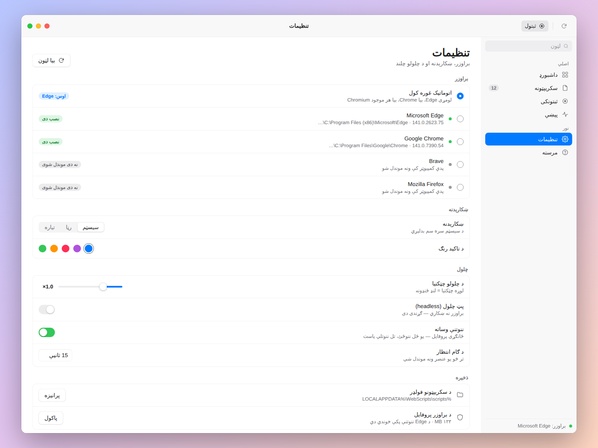
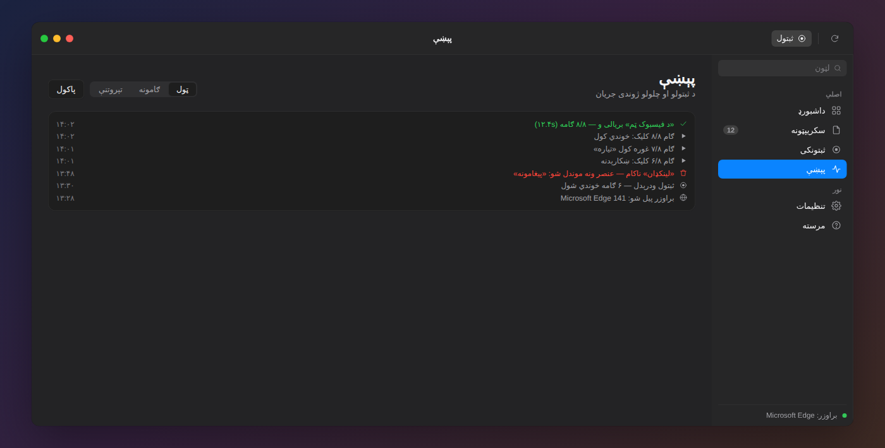
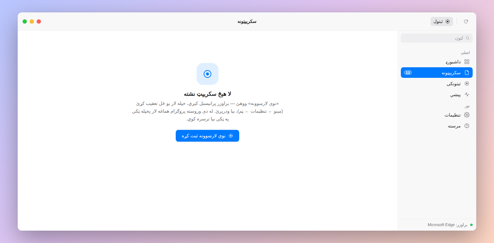

<div dir="rtl">

# WebScripts — یو ځل لار وښایاست، تل به یې پخپله تعقیبوي

په ویب کې خپل کار یو ځل ترسره کړئ — پروګرام ټول کلیکونه، لیکل او تنظیمات **ثبتوي**.
بیا چې کله وغواړئ، په یوه تڼۍ ټوله لار **پخپله** بیا ترسره کوي.

| | |
|---|---|
| پلټفورم | Windows 10/11 |
| بېک اېنډ | Python 3.10+ |
| ظاهري ډیزاین | Flutter (Dart) — د macOS په څېر |
| اتومات کول | Selenium + Edge / Chrome / Brave / Vivaldi / Opera |
| بسته | یو واحد `WebScripts-Setup.exe` (GitHub Actions یې جوړوي) |

## ښکارېدنه

د پروګرام ټول پاڼې د macOS په څېر دي — ټرافیک‌لایټ ټایټل بار، سایډبار،
رنګه کارټونه او نرم انیمېشنونه.

| | |
|---|---|
|  |  |
| **داشبورډ** — رنګه کارټونه، د اونۍ چارټ، وروستي سکریپټونه | **سکریپټونه** — د مدیریت کارټونه، فلټر، نوی سکریپټ |
|  |  |
| **د سکریپټ ګامونه** — سمون، ترتیب، ژوندی پرمختګ | **نوې لارښوونه** — نوم، پته، براوزر |
|  |  |
| **ژوندی ثبتول** — هر ګام همداسې ښکاري | **تنظیمات** — د براوزرونو ریښتینې پېژندنه |
|  |  |
| **پېښې** — تیاره حالت | **تش حالت** |

---

## ستاسو مثال: د فیسبوک ټم بدلول

1. برنامه پرانیزئ او **«نوې لارښوونه»** ووهئ
   نوم: `د فیسبوک ټم` — پته: `https://www.facebook.com`
2. Edge پرانیستل کېږي، پورته ښي خوا کې سور نښان ښیي چې **ثبتول روان دي**
3. په براوزر کې خپله لار تعقیب کړئ:
   مینو ← تنظیمات ← ښکارېدنه ← تیاره ټم
4. بېرته برنامې ته راشئ او **«ثبتول ودروه»** ووهئ
5. سکریپټ خوندي شو ✔

له دې وروسته یوازې د **▶ چلول** تڼۍ کافي ده — پروګرام به پخپله همغه لار ووهي.

> **مهمه:** برنامه د Edge لپاره یو ځانګړی پروفایل کاروي، نو یو ځل چې فیسبوک ته
> ننوځئ، هره بله ګرځېدنه کې هم ننوتلی یاست — د بیا بیا پټنوم لیکلو اړتیا نشته.

---

## براوزر

پروګرام پخپله ګوري چې ستاسو کمپیوټر کې کوم براوزر **په ریښتیا نصب دی** —
Edge، Chrome، Brave، Chromium، Vivaldi، Opera. په تنظیماتو کې یې لیست ګورئ
(نسخه + لاره) او هر یو ټاکلی شئ. «اتوماتیک» لومړی Edge غوره کوي.

Firefox پېژندل کېږي خو لا ملاتړ نه کېږي (Chromium پکار دی).

## نصبول

```powershell
git clone <repo-url>
cd web-scripts-app
powershell -ExecutionPolicy Bypass -File scripts\setup.ps1
```

setup سکریپټ دا کارونه کوي:

- د Python مجازي چاپېریال (`backend\.venv`) جوړوي او کڅوړې نصبوي
- د Flutter وینډوز برخه جوړوي (`flutter create --platforms=windows`)
- ګوري چې Edge نصب دی که نه

**د Edge ډرایور نصبولو ته اړتیا نشته** — Selenium یې پخپله راکوزوي.

## چلول

```powershell
powershell -ExecutionPolicy Bypass -File scripts\run.ps1
```

که Flutter نه لرئ، یوازې بېک اېنډ هم بشپړ کار کوي:

```powershell
powershell -ExecutionPolicy Bypass -File scripts\run.ps1 -BackendOnly
```

---

## یو واحد exe جوړول

هر ځل چې کوډ پورته شي، GitHub Actions پخپله وینډوز نسخه جوړوي:
`.github/workflows/build-windows.yml`

- backend د **PyInstaller** په مرسته یو `webscripts-backend.exe` ته بدلېږي (Python ته اړتیا نشته)
- Flutter وینډوز نسخه جوړېږي
- دواړه د **Inno Setup** په مرسته یو واحد **`WebScripts-Setup-0.1.0-x64.exe`** ته بدلېږي

فایلونه د Actions په **Artifacts** کې دي؛ که `v0.1.0` ټګ ورکړئ، په Release
کې هم ځړول کېږي.

په خپل کمپیوټر کې همدا کار:

```powershell
powershell -ExecutionPolicy Bypass -File packaging\build_windows.ps1
```

## بې ظاهري برنامې (کمانډ لاین)

```powershell
cd backend
.venv\Scripts\python.exe -m webscripts.cli record --name "د فیسبوک ټم" --url https://www.facebook.com
.venv\Scripts\python.exe -m webscripts.cli list
.venv\Scripts\python.exe -m webscripts.cli play scr_ab12cd34ef56
.venv\Scripts\python.exe -m webscripts.cli play scr_ab12cd34ef56 --headless --speed 2
```

| کمانډ | کار |
|---|---|
| `record` | نوې لارښوونه ثبتوي (د پای لپاره Enter ووهئ) |
| `list` | د ټولو سکریپټونو لیست |
| `show <id>` | د یوه سکریپټ ګامونه |
| `play <id>` | چلول |
| `delete <id>` | ړنګول |
| `serve` | یوازې د API سرور |

---

## څه ثبتېږي؟

| کړنه | تشریح |
|---|---|
| کلیک | تڼۍ، لینکونه، مینو، چېک باکسونه |
| لیکل | د متن ډکول (پټنومونه **نه** خوندي کېږي) |
| لیست | د `<select>` انتخاب |
| تڼۍ | Enter او Escape |
| پرانیستل | نوې پته چې پخپله یې ولیکئ |
| کړکۍ | نوی ټب/کړکۍ چې پرانیستل شي |
| iframe | د دننه چوکاټونو کلیکونه هم |

### پټنومونه

که د ثبتولو پرمهال پټنوم ولیکئ، **متن یې نه خوندي کېږي**. پرځای یې یو
متغیر (`{{password}}`) جوړېږي، او د چلولو پرمهال یې برنامه له تاسو غواړي.
دا ارزښتونه هېڅکله فایل ته نه لیکل کېږي.

---

## ولې بیا چلول کار کوي که سایټ بدل شي؟

هر ګام لپاره یوازې یو پته نه، بلکې **څو لارې** ثبتېږي — له تر ټولو ټینګې تر
تر ټولو کمزورې:

```
1. data-testid=…      ← تر ټولو ښه
2. #id (که ثابت وي)
3. name=…
4. aria-label=…
5. placeholder / title
6. د متن له مخې (//button[text()="خوندي کول"])
7. د CSS لار (div > button:nth-of-type(2))
8. بشپړ XPath              ← وروستۍ هڅه
```

د چلولو پرمهال یوه یوه ازمویل کېږي، تر څو یوه ورکار شي. که یوه لار مات شي،
بله یې ځای نیسي.

---

## د سکریپټونو ځای

```
%LOCALAPPDATA%\WebScripts\
├─ scripts\        ← ستاسو سکریپټونه (JSON)
├─ edge-profile\   ← د Edge ځانګړی پروفایل (ستاسو ننوتنې)
├─ screenshots\    ← د ناکامۍ عکسونه
└─ logs\
```

---

## د پروژې جوړښت

```
backend/
├─ webscripts/
│  ├─ models.py      د معلوماتو جوړښت (Script / Step / Target)
│  ├─ storage.py     JSON ذخیره
│  ├─ browsers.py    د نصب شویو براوزرونو پېژندنه
│  ├─ settings.py    د کارونکي تنظیمات (settings.json)
│  ├─ driver.py      د Chromium-کورنۍ ډرایور
│  ├─ js/recorder.js په پاڼه کې ثبتوونکی (JavaScript)
│  ├─ recorder.py    د ثبتولو کړۍ
│  ├─ player.py      بیا چلوونکی
│  ├─ session.py     د براوزر ژوند دوره
│  ├─ server.py      FastAPI + WebSocket
│  └─ cli.py         کمانډ لاین
└─ tests/            pytest (۵۵ ازموینې) + manual_e2e.py

frontend/            Flutter (Dart) — د macOS په څېر ډیسکټاپ برنامه
├─ lib/theme/        د مک ډیزاین ټوکنونه (رنګونه، وړیا فاصلې)
├─ lib/api/          د سرور سره اړیکه + د backend پیلوونکی
├─ lib/models/       ډاټا موډل (سکریپټ، تنظیمات، براوزر)
├─ lib/state/        AppState (provider)
├─ lib/screens/      shell · داشبورډ · سکریپټونه · ګامونه · ثبتونکی · پېښې · تنظیمات · مرسته
└─ lib/widgets/      ټایټل‌بار · سایډبار · د مک کنټرولونه · شیټونه · لاګ

packaging/           PyInstaller spec · Inno Setup · build_windows.ps1
docs/screenshots/    د هرې پاڼې انځورونه
docs/design-source/  هغه HTML/CSS چې انځورونه ترې جوړ شوي (د ډیزاین معیار)
scripts/             setup.ps1 / run.ps1
.github/workflows/   د وینډوز د exe جوړولو CI
```

## ازموینې

```powershell
cd backend
.venv\Scripts\python.exe -m pytest tests -q

cd ..\frontend
flutter test
```

د بشپړې لړۍ ازموینه (اصلي براوزر پرانیزي: یوه پاڼه ثبتوي، بیا یې چلوي او
پایله ګوري) — د نصبولو وروسته یې یو ځل وچلوئ:

```powershell
cd backend
.venv\Scripts\python.exe tests\manual_e2e.py
```

---

## ستونزې او حل

| ستونزه | حل |
|---|---|
| «د Edge پروفایل بل ځای کې پرانیستل شوی» | د WebScripts ټول Edge کړکۍ وتړئ |
| «عنصر ونه موندل شو» | سایټ بدل شوی — هغه ګام ړنګ کړئ او بیا یې ثبت کړئ |
| سرور نه نښلي | `scripts\setup.ps1` بیا وچلوئ |
| ډېر ګړندی چلېږي | د سکریپټ پاڼه کې چټکتیا `0.5×` کړئ |

---

## پام

دا وسیله ستاسو د خپلو حسابونو لپاره ده. د هر سایټ د کارونې شرایط (Terms of
Service) په پام کې ونیسئ — ځینې سایټونه اتومات ګرځېدنه نه مني.

</div>
